# RoboCar Session Codes

Welcome to the **Robocar Session Codes**! This repository contains all the code needed to bring your robot to life. Whether it's dancing, tracing lines, avoiding obstacles, or controlled via Bluetooth.

---

## 📋 Table of Contents

- [1. What You'll Need](#1-what-youll-need)
- [2. Setting Up Your Arduino Board](#2-setting-up-your-arduino-board)
  - [2.1 Install Arduino IDE](#21-install-arduino-ide)
  - [2.2 Install CP210x USB to UART Driver](#22-install-cp210x-usb-to-uart-driver)
  - [2.3 Connect the Arduino Board](#23-connect-the-arduino-board)
- [3. Uploading the Code](#3-uploading-the-code)
- [4. Sessions Overview](#4-sessions-overview)
  - [Session 1: Robot Dance](#session-1-robot-dance)
  - [Session 2: Line Tracing & Light Seeking](#session-2-line-tracing--light-seeking)
  - [Session 3: Ultrasonic Avoidance & Follow](#session-3-ultrasonic-avoidance--follow)
  - [Session 4: Bluetooth App Control](#session-4-bluetooth-app-control)

---

## 1. What You'll Need

🛠️ **Hardware:**

- Laptop
- Robocar Kit
  - Arduino UNO
  - Arduino Shield
  - USB cable (USB 2.0 Type A/B cable)
  - Robot chassis
  - Motors + Wheels
  - Photoresistor
  - Line Tracking Sensor Module
  - Ultrasonic sensor + Servo Motor
  - IR sensors
  - Bluetooth module (JDY-16)

🖥️ **Software:**

- Arduino IDE
- CH340 driver

---

## 2. Setting Up Your Arduino Board

### 2.1 Install Arduino IDE

1. Go to the [Arduino official website](https://www.arduino.cc/en/software)
2. Download the version for your operating system (Windows/Mac/Linux)
   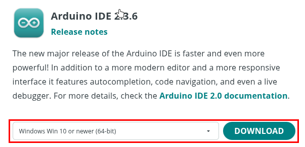
3. Run the installer and follow the on-screen instructions
4. Once installed, open the **Arduino IDE**

#### 2.2 Install CH340 USB Driver

Most LAFVIN-branded Arduino boards use the **CH340** USB-to-serial converter. To allow your computer to communicate with the board:

###### Method 1:

1. Download the [CH340 Driver](https://sparks.gogo.co.nz/ch340.html?srsltid=AfmBOoo-VpLzg2QWFC9j2-Dvp2VMOiS8vyg5S5UUTKyQdNNLjJ0RnwBa) and extract the folder to a known location on your computer.
   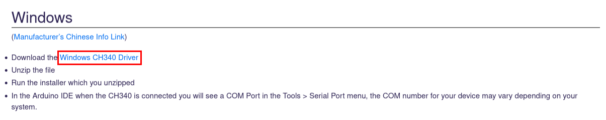
1. Open the installer and install.

   (You may need to restart you laptop after installation)

###### Method 2: (if method 1 didn't work)

1. Download the [CH340/CH341 Driver](https://www.wch-ic.com/downloads/ch341ser_zip.html) and extract the folder to a known location on your computer.
2. Plug your Arduino board into your computer via USB.
3. Open **Device Manager** (Windows: press `Win + X` and select Device Manager).
4. Find your Arduino device under **Other devices** or **Ports (COM & LPT)**—it may show as "Unknown device" or similar.
   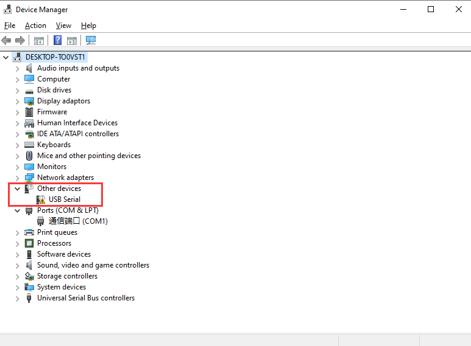
5. Right-click the device and choose **Update driver**.
   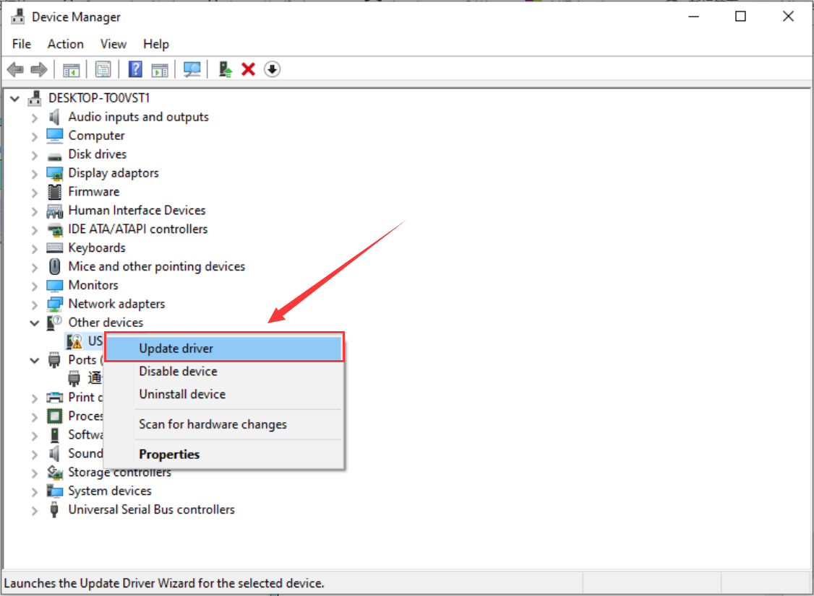
6. Select **Browse my computer for drivers**.
   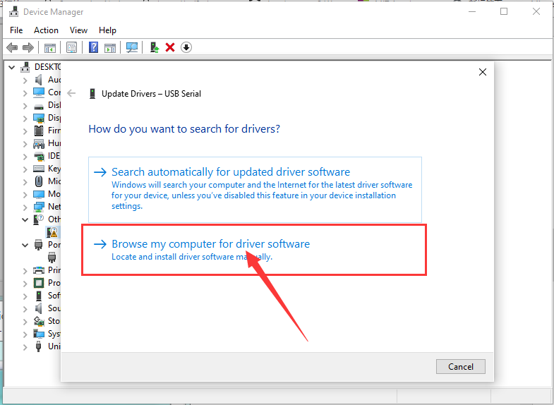
7. Navigate to the folder where you extracted and downloaded the CH340 driver folder.
   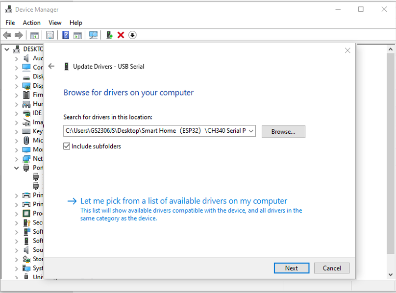
8. Click **Next** and follow the prompts to install the driver.
   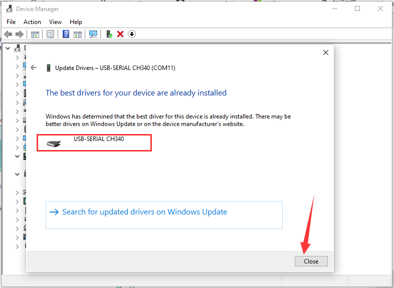
9. Confirm that the CH340 driver has been installed successfully and restart your computer after installation.
   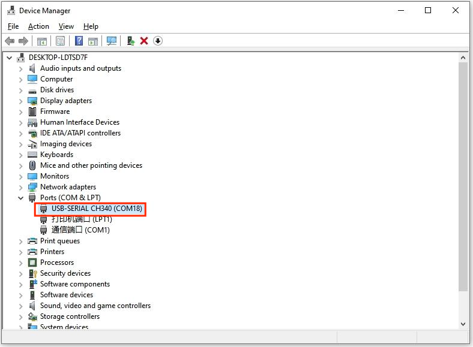

> If unsure which driver you need, check your board's chip or refer to the guide linked above.

### 2.3 Connect the Arduino Board

1. Plug the Arduino into your computer using the USB cable
2. Open Arduino IDE
3. Go to **Tools > Board** and select your board model (e.g., "Arduino Uno")
   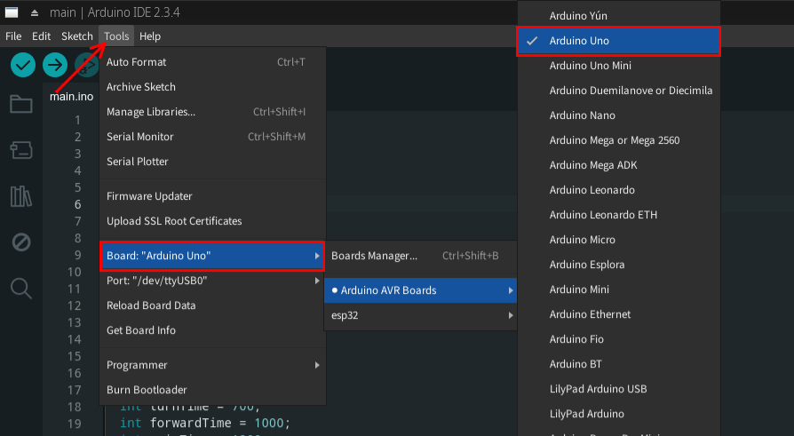
4. Go to **Tools > Port** and select the correct COM port:

   - It will appear as something like `COM4` or similar in Windows

   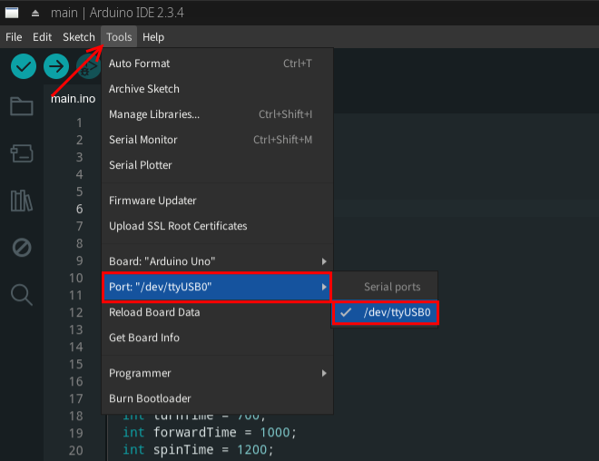

   (in this example image it's different, but most of the case it will start with `COM`)

> If the port doesn't appear, recheck the CH340 driver installation and try a different USB cable (ensure it supports data).

## 3. Uploading the Code

1. Go to the folder e.g. `session1` and open the `.ino` file
   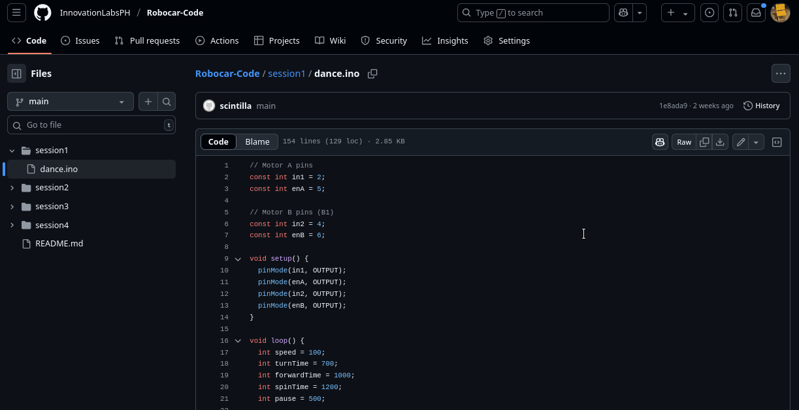
1. Download or simply copy the code
   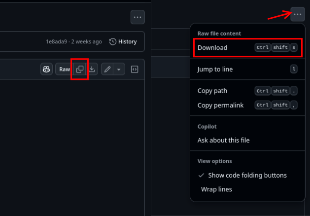
1. Open the Arduino IDE
1. Click **File > Open** and choose the `.ino` file that you've downloaded or just simply create a new sketch and paste the code
   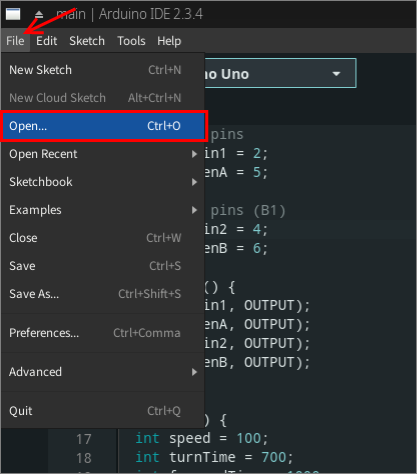
1. Make sure your board and port are still selected under **Tools**
1. Click the **✔️ Verify** button to compile the code
   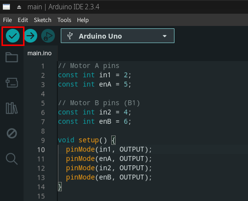
1. Click the **➡️ Upload** button to upload it to your Arduino
   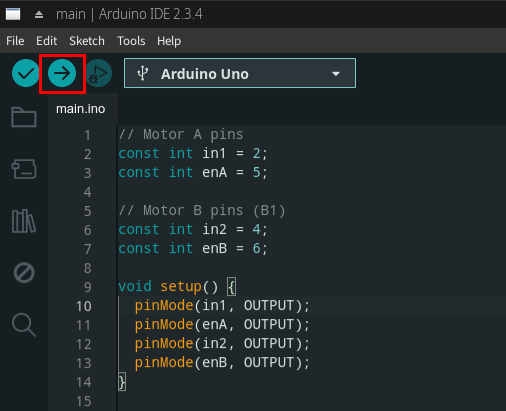

> Upload only **one sketch at a time**. Uploading a new sketch replaces the old one on the Arduino.

---

## 4. Sessions Overview

### Session 1: Robot Dance

**Folder:** `session1`

- This makes your robot perform dance movements!

### Session 2: Line Tracing & Light Seeking

**Folder:** `session2`

- Robot follows a line and moves toward light sources

### Session 3: Ultrasonic Avoidance & Follow

**Folder:** `session3`

- Robot avoids obstacles or follows a target using distance sensing

### Session 4: Bluetooth App Control

**Folder:** `session4`

- Control the robot from your smartphone

---

Happy Building!

Feel free to contact us at Sorsogon Community Innovation Labs or [open an issue](https://github.com/InnovationLabsPH/Robocar-Code/issues) if you run into any trouble!
